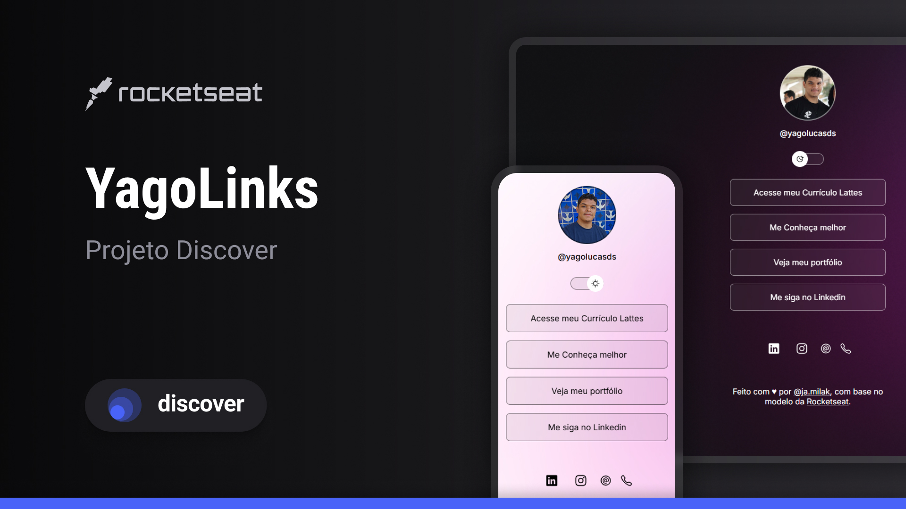

<h1 align="center"> YagoLinks </h1>

Programa exclusivo e gratuito, promovido pela Rocketseat para ensino de tecnologias WEB.

  <a href="#-tecnologias">Tecnologias</a>&nbsp;&nbsp;&nbsp;|&nbsp;&nbsp;&nbsp;
  <a href="#-projeto">Projeto</a>&nbsp;&nbsp;&nbsp;|&nbsp;&nbsp;&nbsp;
  <a href="#-layout">Layout</a>&nbsp;&nbsp;&nbsp;|&nbsp;&nbsp;&nbsp;
  <a href="#memo-licença">Licença</a>

  

 

  

## 🚀 Tecnologias

Esse projeto foi desenvolvido com as seguintes tecnologias:

- HTML e CSS
- JavaScript
- Git e Github

## 💻 Projeto

O Yagolinks é um agregador de links para usar como cartão de visitas.

## 🔖 Layout

Você pode visualizar o layout do projeto através [DESSE LINK](https://www.figma.com/design/plUijh48B6nkCmQtHpsXTx/YagoLinks-%E2%80%A2-Projeto-Discover--Community-?m=auto&t=9cWx8Tpv3FyhmfNv-6). É necessário ter conta no [Figma](https://figma.com) para acessá-lo.

## 📝 Licença

Esse projeto está sob a licença MIT.

---

  Feito com ♥ por 
  <a href="https://www.instagram.com/ja.milak/" target="_blank">@ja.milak</a>, 
  com base no modelo da 
  <a href="https://rocketseat.com.br/" target="_blank">Rocketseat</a>. 
  <a href="https://discord.gg/rocketseat" target="_blank">Participe da nossa comunidade!</a>

